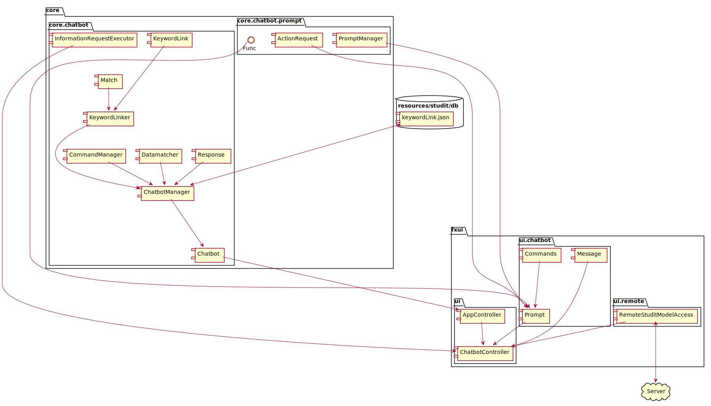

# Chatbot

*The chatbot package contains all logic related to the following aspects:*
*  Mapping of user entered messages and identifying which words were passed.
*  Deducting what command the chatbot should process, and what to respond.
*  Manage, update, and create json files related to chatbot functionallity.

# Current supported functionallity

*The chatbot can handle the following responses:*
*  Ask for help: "jeg trenger hjelp", "jeg forstår ikke", "hvilken funksjoner har du?"
*  Greetings: "hei", "Heisann", "halla", "hva skjer?", "hvordan går det?"...
*  Goodbyes: "hade", "adjø", "takk for hjelpen", "vi snakkes"...
*  Exiting: "jeg vil avslutte", "avslutt" -> Gives user prompt to exit chatbot.
*  Api Related:
    * Course overview: "kan jeg se fagoversikten?", "oversikt fag"...
    * Course information: "jeg vil vite mer om Statistikk", "kan du fortelle mer om TMA4120?"...
    * Exam information: "Jeg vil vite mer om eksamen i diskret matematikk", "når er eksamen i IT1901?", "I kjemi, blir det hjemmeksamen?", "hvilken hjelpemidler er tillatt på eksamen i Matematikk 1?"
    * Tips & tricks: "har du noen tips i kjemi?", "har du noen anbefalinger i TMA4140?"...
    * Curricilum: "I Mekanikk 1, hva er pensum?", "hvilke bøker må jeg kjøpe i kjemi?"...
    * Reccomended litterature: "hva er anbefalt lesestoff i statistikk?", "hvilken bøker bør jeg kjøpe i Informatikk Prosjektarbeid 1?"...

The examples provided above is are just that, examples, the chatbot understands quite a few different variations of the sentances with different wording. The chatbot is also quite robust against spelling errors, and will often recognize what words if you are typing, even if it is misspelled quite badly. For long words the chatbot is especially accurate despite numerous spelling errors. However the chatbot struggles with keywords, and it is preferable to write full sentences.

# Chatbot Structure

Below is an architecture diagram showing the relations between the different classes in the different packages.

To summarize:
*  The `ChatbotManager` handles most of the logic in the core module, which is determining what command to map the user input to. This is done by reading the json file "keywordlinks.json", which contains information about all availble commands, and what words and datatypes are associated with the given command.
*  The `KeywordLinker` gets input the user written messages, and first identify what words are used, then maps them to the most probable commands. A list of `Match` objects is created for every command, and they are each assigned a weight which signifies our confidence that the user requested a certain command.
*  If the `KeywordLinker` found a command that is looking for a certain type of data, the `DataMatcher` tries to identify the data from the user input, e.g trying to find a course title. 
*  The `CommandManager` returns a new `Response` object containing what the chatbot should reply, based on the command with the highest weight.
*  The results from the `ChatbotManager` are passed to the `ChatbotController` where there are several different branches based on what `Response` object the core logic produced.
   * The controller simply prints the chatbot response to the screen (no further action required)
   * The response object contains a request for information based on the api -> The controller fetches api data, passes it to `InformationRequestExecutor` which then updates the response object accordingly.
   * The response object contains a prompt -> We need the user to select between a certain number of options. A new `Prompt` object is created, and the prompt data in the response object is handled by the `PromptManager`. A new `ActionRequest` is formed, which contains what functions should be called and with what arguments. Each option the user gets presented with gets assigned a Functional Interface `Func`, which is found in a HashMap in the `Commands` class and executed if the user selects the spesific option corresponding to the function. 

