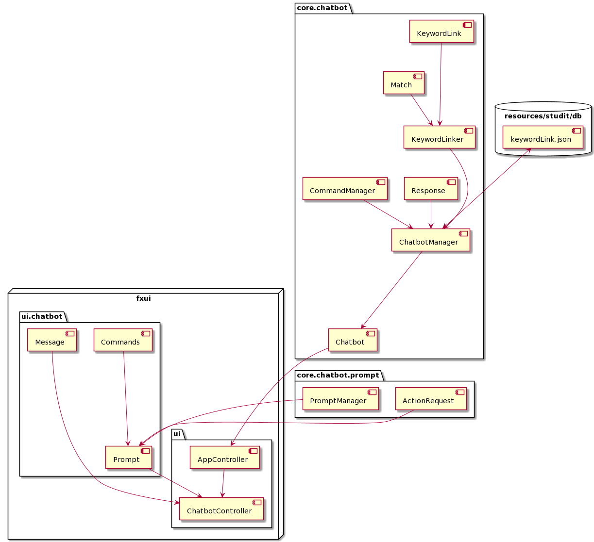

# Chatbot

*The chatbot package contains all logic related to the following aspects:*
*  Mapping of user entered messages and identifying which words were passed.
*  Deducting what command the chatbot should process, and what to respond.
*  Manage, update, and create json files related to chatbot functionallity.

# Current supported functionallity

*The chatbot can handle the following responses:*
*  Greetings: "hei", "Heisann", "halla", "hva skjer?", "hvordan går det?"...
*  Goodbyes: "hade", "adjø", "takk for hjelpen", "vi snakkes"...
*  Prompts: "jeg vil avslutte", "avslutt" -> Gives user prompt to exit chatbot.

# Future implementations

*As of today, most of the work has been to create an infrastructure to simplify
the process of implementing further functionallity. It is fairly easy to expand
the functionallity of the chatbot, add new commands e.t.c when the infrasturcture
is sufficiently robust.*

**Current plans:**
*  Extend KeywordLink functionallity:
    *  Support for grouping probable word combinations
    *  Add negative synergy between words
    *  Add option to only be evaluated if the chatbot has asked a certain question
    *  Add a tag for what values are expceted to the command
*  Add commands for the chatbot to handle:
    * "Fortell meg om TMA4100"
    * "Bør jeg kjøpe boken i Statistikk?"
    * "Når er eksamen i Matte?"

# Chatbot Structure

