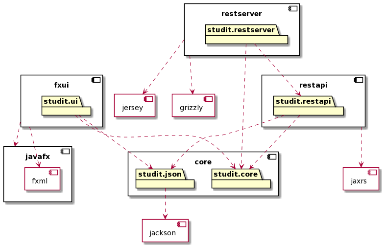

# NTNU - Choose the right course?

* This project is a three-layer application, with domain, user interface (UI) and persistence. The project consists of tests with good coverage and is configured to use **maven** as build tool.

* The project is configured with multiple modules with maven. The domain and persistence layer can be found in the core-module (core) and the user interface in the ui-module (fxui)

## Architecture Diagram
